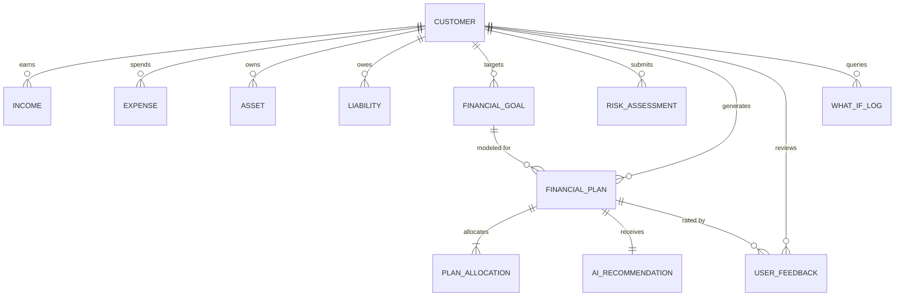

# 🐘 Octovova Finance — PostgreSQL Database Architecture & Setup

This directory contains the production PostgreSQL schema, seed data, and migration files based on the GenAI Finance Planning Engine architecture blueprint.

---

## 📁 Files in this Directory

- `schema.sql`: Contains the complete DDL table creation scripts, enums, cryptographic UUID generation, foreign keys, and high-performance indexes.
- `seed.sql`: Contains initial benchmark market data (NIFTY & AMFI return/volatility metrics) and Priya Sharma's seeded profile.

---

## 🚀 How to Run & Initialize PostgreSQL

### Option 1: Local Docker Container (Fastest)

1. Run a local PostgreSQL 16 instance:
```bash
docker run --name octovova-postgres \
  -e POSTGRES_USER=postgres \
  -e POSTGRES_PASSWORD=postgres \
  -e POSTGRES_DB=octovova_db \
  -p 5432:5432 \
  -d postgres:16
```

2. Execute the schema and seed scripts:
```bash
# Apply schema
docker exec -i octovova-postgres psql -U postgres -d octovova_db < database/schema.sql

# Apply seed data
docker exec -i octovova-postgres psql -U postgres -d octovova_db < database/seed.sql
```

---

### Option 2: Cloud PostgreSQL (Supabase / Neon / AWS RDS / Railway)

1. Create a project in [Supabase](https://supabase.com) or [Neon](https://neon.tech).
2. Open the **SQL Editor** in the dashboard.
3. Paste and run `database/schema.sql`, then `database/seed.sql`.
4. Copy your project's **API URL** and **Anon Public Key**.
5. Add them to your `.env` file in the project root:
```env
VITE_SUPABASE_URL=https://<your-project-ref>.supabase.co
VITE_SUPABASE_ANON_KEY=<your-anon-key>
```
6. The frontend will immediately connect and synchronize data directly with your PostgreSQL database!

---

## 📊 Database Schema Entity Relationships



---

## 🏛️ Store vs. Recompute Architectural Rules

1. **Net Worth**: Recomputed on read (`SUM(assets) - SUM(liabilities)`). Never stored permanently to prevent staleness.
2. **Risk Score & Category**: Stored permanently point-in-time.
3. **Goal FV / Required SIP**: Live-recomputed on current assumptions; snapshotted into `financial_plan` at plan-generation time tagged with `engine_version`.
4. **Monte Carlo Probability**: Computed once at plan-generation time and stored alongside the plan.
5. **AI Narrative & Prompts**: Stored once with `model_version` and `prompt_version` for auditability and cost optimization.
6. **Market Data**: Stored in `market_data` table so updating macro market return assumptions is a database update rather than code changes.
